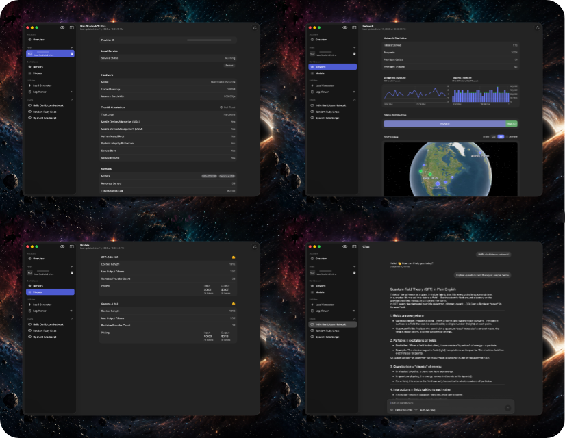

# Darkbloom Dashboard
> Monitor your darkbloom machines and earnings.

What is Darkbloom?

[Darkbloom](https://www.darkbloom.dev) is a private and secure AI inference network powered by Apple hardware.

Anyone with a sufficiently powerful Mac (MacBook Pro, Mac Studio, etc.) can run the Darkbloom software and become a provider by hosting local AI models and running private inference for users of the network.

Modern Macs featuring unified memory, high memory bandwidth and verifiable trust through mobile device attestation, secure root and other technologies, make it entirely possible to run local inference in a way that's both secure and economical.

> [!NOTE]
> This project is not endorsed by or affiliated with EigenLabs, EigenLayer, darkbloom or any other involved parties. I built this for my own use, and open-sourced it so other providers can benefit from it as well.

## Features

This app features a wide variety of tools to make your life as a darkbloom provider easier.

- Check darkbloom network health
- Monitor your machines and spot issues quickly
- View detailed provider statistics (hardware, trust, traffic, etc.)
- Check your account balance and projected earnings
- Generate load on the network (uses your API key to inject traffic)
- Warm up machines in order to get them ready to receive requests
- Smart provider restart with automatic model warmup
- View local darkbloom logs in real-time (macOS only)
- Chat on the darkbloom network

## Platform Support

- macOS 15+
- iOS 18+
- visionOS 26+

## Building

1. Open in Xcode 26
1. Build
1. ???
1. Profit!
